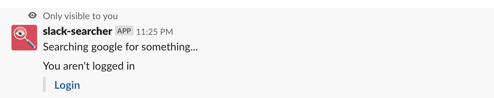
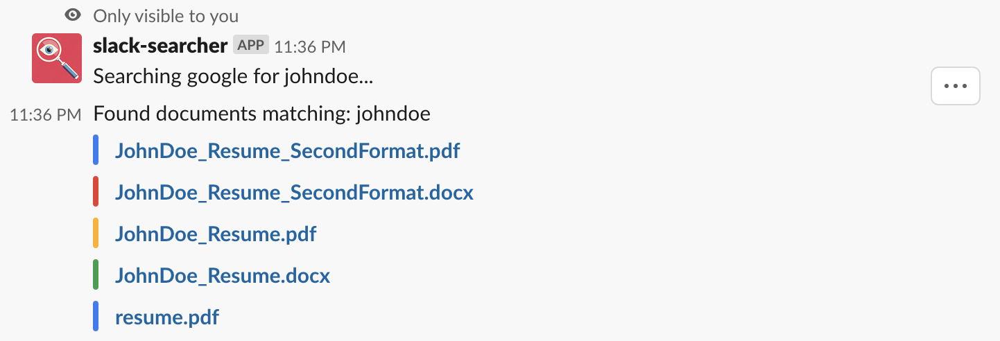
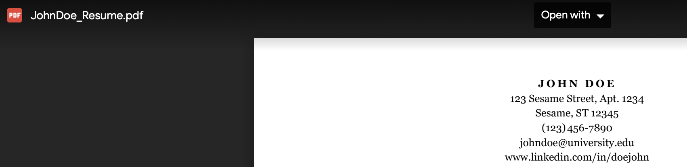

# Slack Searcher

This is a bot that allows you to search different services using slack commands

### Current services you can interact with
- Google Drive
- Github

Commands are made by using the /from slash command in slack

The basic format is /from [service] [term]

### Commands
- `/from google _term_` would search your google drive for `_term`
- `/from github _repo_` would search your github repos (public/private) for `_repo_`

On first attempt, the app requests you log in through gsuite sign in


## Google drive
Searching personal google drive for `johndoe`


Results


Links to resume in google drive:


## Github
Searching personal github repos for `basketball`


Results


Links to public repository in github:
https://github.com/jakemanning/basketball-teams


#### Some dev notes:
- When requests are made to get google access token, request only returns refresh token the <strong><em>first</em></strong> time after authorizing the app.
    If you didn't save this token, you will have to revoke the [app permissions](https://security.google.com/settings/security/permissions), and then authenticate the user.
- .env can be retrieved from heroku by performing:  ```heroku config:pull```